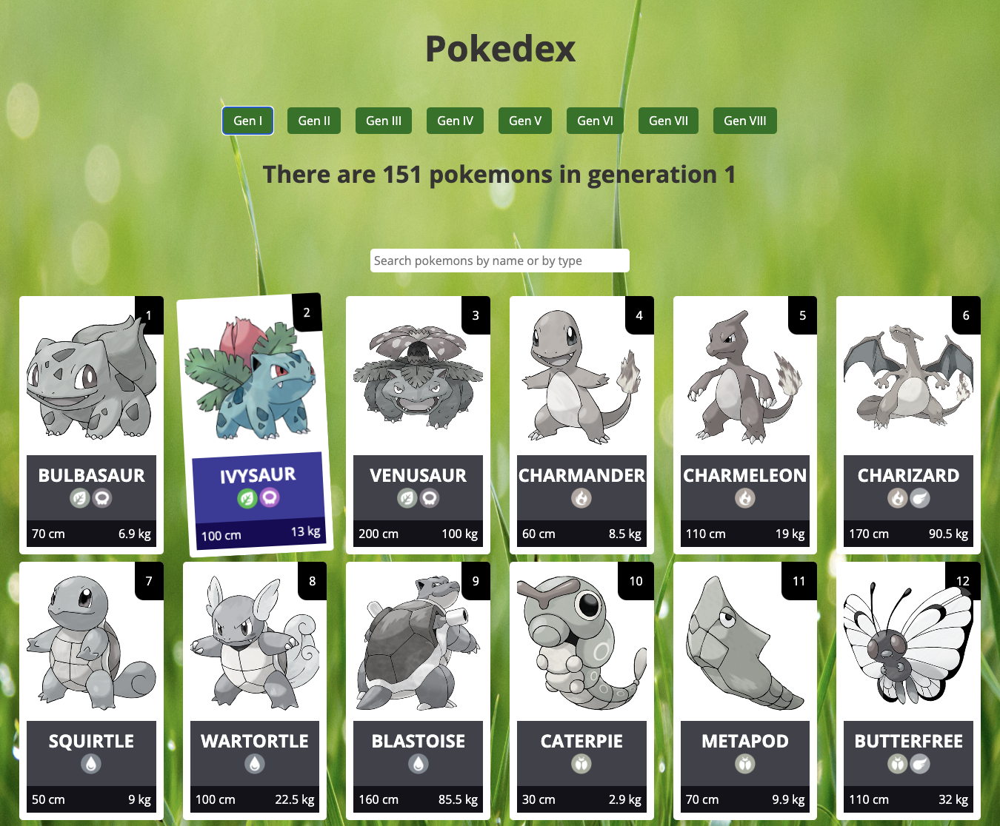

# Pokedex

## General Information

Poxedex presents the Pokémon data including their images, generations, and types. The Pokemon cards are filtered by generation, inside each generation you can search for a specific Pokemon by name or type.
The data is accessed through a free open-source RESTful API.

## Technologies Used

JavaScript, HTML, CSS

### **Check it out!**

[Pokedex](https://relaxed-fox-a5e58f.netlify.app)
